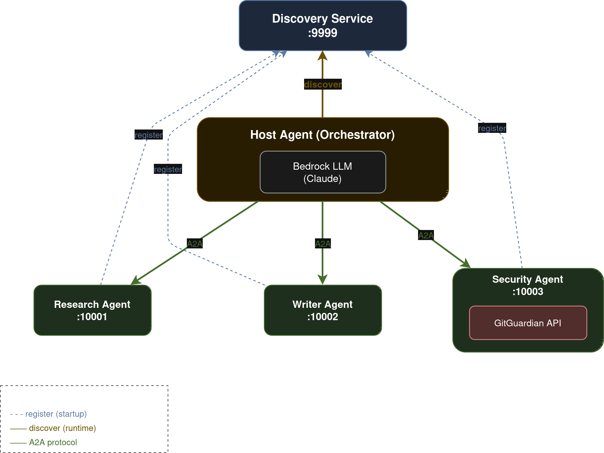
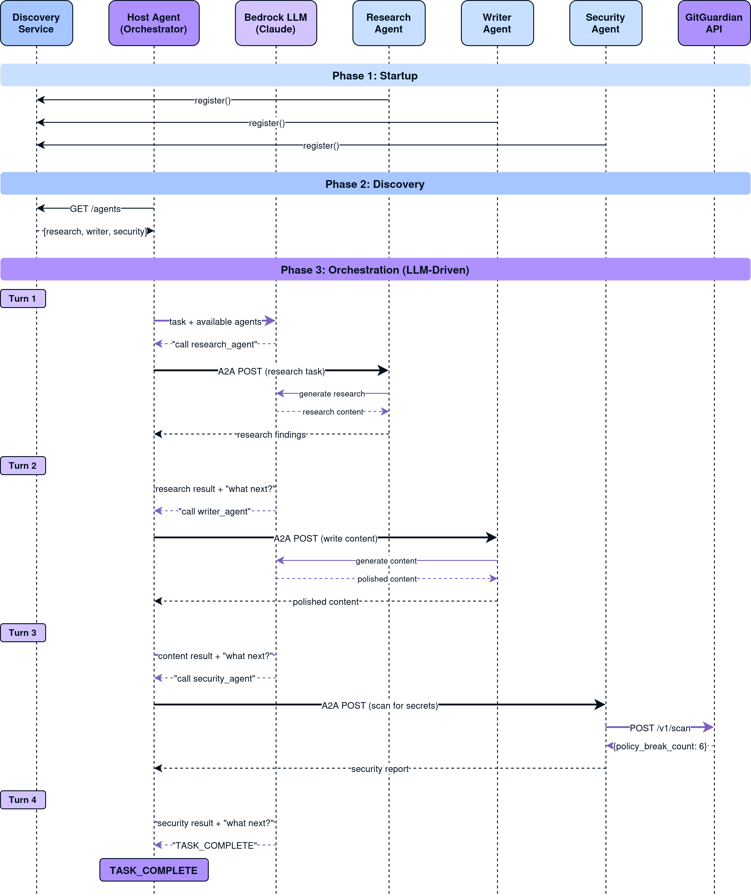
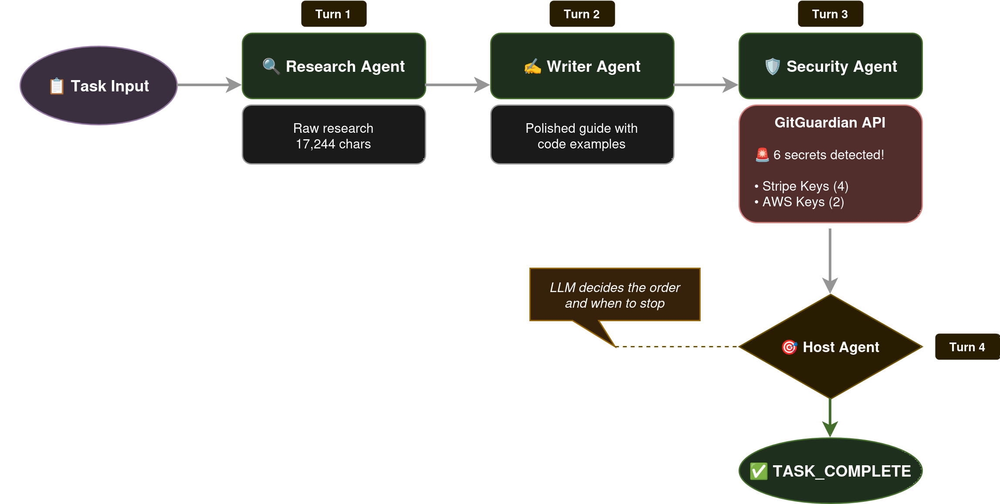

# Building a Multi-Agent Security Pipeline with Google ADK and GitGuardian

**TL;DR**: I built a demo showing how to wire up multiple AI agents using Google's Agent Development Kit (ADK) and the A2A protocol, with GitGuardian scanning content for secrets. The interesting part? There's no hardcoded workflow—the LLM decides which agents to call and when to stop.

---

## What We're Building

Multi-agent systems are gaining traction, but most demos I've seen have one thing in common: hardcoded orchestration. Agent A calls Agent B, which calls Agent C. Predictable, but not particularly intelligent.

This demo takes a different approach. We have three specialist agents:
- **Research Agent** - gathers information on a topic
- **Writer Agent** - transforms research into polished content
- **Security Agent** - scans content for exposed secrets using GitGuardian

The twist? None of these agents know about each other. An orchestrator discovers them at runtime from a registry service, tells the LLM what's available, and lets the model decide the execution order. The LLM also decides when the task is complete.



---

## A2A: The Protocol Connecting Agents

Google's [Agent-to-Agent (A2A) protocol](https://github.com/google/a2a) is an open standard for agent interoperability. Each agent exposes an `AgentCard`—a JSON document describing its capabilities—at a well-known endpoint:

```
http://localhost:10001/.well-known/agent-card.json
```

This means agents can be discovered and invoked without prior knowledge of their implementation. Think of it like OpenAPI specs, but for AI agents.

The [Agent Development Kit (ADK)](https://github.com/google/adk-python) provides the tooling to build agents and expose them via A2A with minimal boilerplate.

---

## Why Bedrock Instead of Gemini?

Google ADK defaults to Gemini, but thanks to LiteLLM integration, we can swap in any supported model. I'm using Claude on AWS Bedrock:

```python
from google.adk.models.lite_llm import LiteLlm

BEDROCK_MODEL = LiteLlm(model="bedrock/eu.anthropic.claude-haiku-4-5-20251001-v1:0")
```

This demonstrates that A2A and ADK are model-agnostic—your agents can run on whatever LLM fits your requirements.

---

## Dynamic Agent Discovery

Here's where it gets interesting. The host agent doesn't have a hardcoded list of sub-agents. Instead, it queries a Discovery Service at runtime:

```python
async def create_host_agent_with_discovery() -> Agent:
    # Query the Discovery Service for all registered agents
    discovered_agents = await discover_agents()

    # Create RemoteA2aAgent wrappers for each discovered agent
    sub_agents = []
    for agent_info in discovered_agents:
        remote_agent = RemoteA2aAgent(
            name=agent_info.name,
            description=agent_info.description,
            agent_card=f"{agent_info.url}/.well-known/agent-card.json",
        )
        sub_agents.append(remote_agent)

    # The LLM sees these as available tools
    host = Agent(
        name="host_agent",
        model=BEDROCK_MODEL,
        instruction=f"""You have access to these agents:

{agent_descriptions}

Call exactly ONE agent per turn. Say "TASK_COMPLETE" when finished.""",
        sub_agents=sub_agents,
    )
    return host
```

The agents register themselves with the Discovery Service on startup. Add a new agent? It appears in the next orchestration run without code changes.



---

## LLM-Driven Orchestration

Traditional orchestration looks like this:

```python
# Hardcoded workflow - brittle and inflexible
result = research_agent.run(task)
result = writer_agent.run(result)
result = security_agent.run(result)
```

Our approach lets the LLM decide:

```python
for turn in range(max_turns):
    # Ask LLM: "What should we do next?"
    async for event in runner.run_async(session_id=session.id, new_message=content):
        # LLM decides which agent to call (or signals completion)
        ...

    if "TASK_COMPLETE" in response:
        break

    # Prepare next turn with updated context
    current_message = f"The {agent_called} completed. What's next?"
```

The host agent's instruction tells it the rules: delegate to one agent per turn, and say "TASK_COMPLETE" when finished. The model figures out the rest.

---

## The Turn Limit: A Necessary Guard Rail

Letting an LLM decide when to stop sounds risky. What if it never stops?

That's why we have a `max_turns` parameter:

```python
async def run_host_agent(task: str, max_turns: int = 5):
    for turn in range(max_turns):
        # ... orchestration logic ...

        if "TASK_COMPLETE" in response:
            break

    if turn == max_turns - 1:
        print(f"Reached max turns ({max_turns})")
```

This prevents runaway execution while giving the LLM enough room to complete complex tasks. In practice, most tasks complete in 3-4 turns.

---

## GitGuardian Integration

The Security Agent wraps GitGuardian's API to scan content for exposed secrets:

```python
def scan_for_secrets(content: str) -> str:
    response = requests.post(
        "https://api.gitguardian.com/v1/scan",
        headers={"Authorization": f"Token {api_key}"},
        json={"document": content, "filename": "content.txt"},
    )

    result = response.json()
    if result.get("policy_break_count", 0) > 0:
        return f"SECRETS DETECTED: {result['policy_break_count']} found!"
    return "No secrets detected"
```

To make the demo more interesting, the Research and Writer agents are instructed to include realistic-looking fake credentials in their "anti-pattern" examples. This triggers GitGuardian's detection, demonstrating the security pipeline in action.



---

## Running the Demo

Here's what happens when we run the orchestration:

```
🌟 ADK + A2A DEMO - Multi-Agent Orchestration
============================================================
📋 Task: Create a guide about storing API credentials securely...

📡 Starting Discovery Service (:9999)...
📡 Starting A2A agents...
   - Research Agent (:10001)  ✅ Registered
   - Writer Agent (:10002)    ✅ Registered
   - Security Agent (:10003)  ✅ Registered

============================================================
🎯 RUNNING HOST AGENT
============================================================
📡 Querying Discovery Service...
✅ Discovered 3 agent(s)

🚀 Starting orchestration loop...
------------------------------------------------------------

[Turn 1/5]
   📤 Calling Bedrock LLM (Host Agent)...
   🔍 Research Agent activated
      → Bedrock LLM: researching topic...
   ✅ research_agent completed (17244 chars)

[Turn 2/5]
   📤 Calling Bedrock LLM (Host Agent)...
   ✍️  Writer Agent activated
      → Bedrock LLM: writing content...
   ✅ writer_agent completed (3078 chars)

[Turn 3/5]
   📤 Calling Bedrock LLM (Host Agent)...
   🛡️  Security Agent activated
      → GitGuardian API: POST /v1/scan
      → Scanning 16578 chars of content...
      ← Response: {
          "policy_break_count": 6,
          "policy_breaks": [
            {"type": "Stripe Keys", "match": "sk_live_..."},
            {"type": "AWS Access Key", "match": "AKIA..."},
            ...
          ]
        }
   ✅ security_agent completed (5197 chars)

[Turn 4/5]
   📤 Calling Bedrock LLM (Host Agent)...

============================================================
✅ TASK_COMPLETE - All agents finished
============================================================
```

The LLM chose to call Research → Writer → Security, then signaled completion. GitGuardian found 6 secrets in the generated content (the intentional fake credentials in the anti-pattern examples).

---

## Key Takeaways

1. **Dynamic Discovery** - Agents register themselves; the orchestrator finds them at runtime
2. **LLM-Driven Routing** - No hardcoded workflow; the model decides execution order
3. **Model Agnostic** - ADK works with Bedrock, not just Gemini
4. **Guard Rails Matter** - Turn limits prevent infinite loops
5. **Real Security Scanning** - GitGuardian catches secrets even in AI-generated content

---

## Try It Yourself

The complete code is available at: [REPO_LINK_PLACEHOLDER]

```bash
pip install "google-adk[a2a]" uvicorn httpx fastapi
export GITGUARDIAN_API_KEY="your-key"
python examples/adk_a2a/run_demo.py
```

---

## Further Reading

- [Google A2A Protocol Specification](https://github.com/google/a2a)
- [Google Agent Development Kit (ADK)](https://github.com/google/adk-python)
- [GitGuardian API Documentation](https://docs.gitguardian.com/api)
- [LiteLLM - Universal LLM Gateway](https://github.com/BerriAI/litellm)

